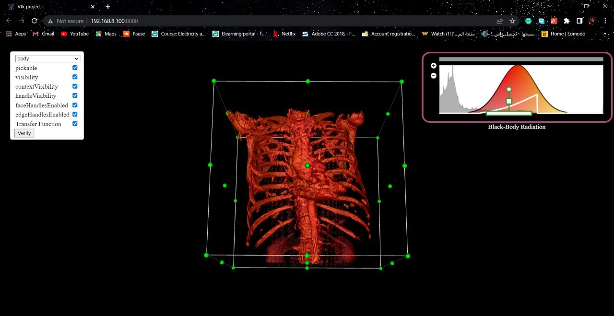

# vtk-project

| Team Members              |
| ----------------- |
| Abdullah Saeed    |
| Nada Mohamed      |
| Radwa Omar        |
| Hana Fares        |

- ### important note: our main files are:
 1. src\index.js 
 2. src\isosurface.js
 3. src\raycasting.js
 

# Volume Rendering (VTK)

- The main idea of the project was to understand how VTK.js work and how to use it.
- First of all we installed node.js
- Then we started running some examples from the VTK.js website and here are some screenshots:

#### 1. Controlling isovalue:        
 

####  2. Ray casting :

#### 3. PiecewiseGaussianWidget: 

## Issues we faced:
1. it was hard to understand VTK and modify the examples to match the requirements of the project.
2. it was hard to understand HTML , Css and js for the first time, which took us most of the time.
3. It was hard to know how to read variables from the html to the js, but we found it in the tutorial as a hint.
4. Sometimes when running the code there are no errors shown but the website doesn't work so we had to open inspect to see what is happening to the console.
5. we tried to load the head and chest data one single time to make the website faster, but we couldn't.
6. It was hard to us to understand the PiecewiseGaussianWidget as it was not implemented as html so it took time from us to uderstand how it works.
&nbsp;

## Our website:
#### 1. Controlling isovalue:

&nbsp;
#### 2. Dropdown menu:

&nbsp;
#### 3. Ray Casting with transfer function:

We made the transfer function as a checkbox with the other options to let the user choose whether he wants it or no.

&nbsp;
## Final thoughts:
- The project had a lot of advantages to us as students as well as engineers like time mangaments, self learning , html+css+js+vtk+react concepts ..etc
- we thought that this project will be much easier, but as a team we managed to solve all the problems and to get thid project done.
 

